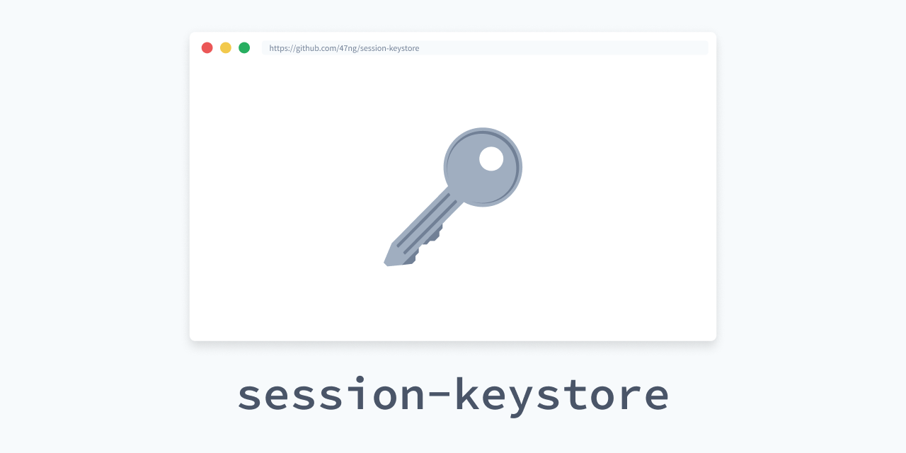

[](https://github.com/47ng/session-keystore/blob/master/LICENSE)
[](https://travis-ci.com/47ng/session-keystore)
[](https://isitmaintained.com/project/47ng/session-keystore)
[](https://isitmaintained.com/project/47ng/session-keystore)

Secure cryptographic key storage in the browser.

Ideal to store keys derived from user credentials (username/password) in
E2EE applications.

## Features

- In-memory storage: no clear-text persistance to disk
- Session-bound: cleared when closing tab/window
- Survives hard-reloads of the page
- Optional expiration dates
- Notification callbacks on key access and key expiration

## Installation

```shell
$ yarn add session-keystore
# or
$ npm i session-keystore
```

## Usage

```ts
import SessionKeystore from 'session-keystore'

// Create a store
const store = new SessionKeystore()

// You can create multiple stores, but give them a unique name:
// (default name is 'default')
const otherStore = new SessionKeystore({ name: 'other' })

// Save a session-bound key
store.set('foo', 'supersecret')

// Set an expiration date (Date or timestamp in ms)
store.set('bar', 'supersecret', Date.now() + 1000 * 60 * 5) // 5 minutes

// Retrieve the key
const key = store.get('bar')
// key will be null if it has expired

// Revoke a single key
store.delete('foo')

// Clear all keys in storage
store.clear()
```

## Notification callbacks

Pass callbacks to be notified on key access, change or expiration:

```ts
import SessionKeystore from 'session-keystore'

const store = new SessionKeystore({
  name: 'my-store',
  onAccess: (keyName: string, callStack?: string) => {
    console.info('Key access:', keyName, callStack)
  },
  onChanged: (keyName: string, callStack?: string) => {
    console.warn('Key changed:', keyName, callStack)
  },
  onExpired: (keyName: string) => {
    console.warn('Key has expired:', keyName)
  }
})
```

## TypeScript

`session-keystore` is written in TypeScript. You can tell a store about the keys it is supposed to hold:

```ts
import SessionKeystore from 'session-keystore'

const store = new SessionKeystore<'foo' | 'bar'>()

store.get('foo') // ok
store.get('bar') // ok
store.get('egg') // Error: Argument of type '"egg"' is not assignable to parameter of type '"foo" | "bar"'
```

This can be handy if you have multiple stores, to avoid accidental key leakage.

## How it works

Heavily inspired from the [Secure Session Storage](https://github.com/ProtonMail/proton-shared/blob/master/lib/helpers/secureSessionStorage.js#L7) implementation by [ProtonMail](https://protonmail.com),
itself inspired from Thomas Frank's [SessionVars](https://www.thomasfrank.se/sessionvars.html).

From the ProtonMail documentation:

> However, we aim to deliberately be non-persistent. This is useful for
> data that wants to be preserved across refreshes, but is too sensitive
> to be safely written to disk. Unfortunately, although sessionStorage is
> deleted when a session ends, major browsers automatically write it
> to disk to enable a session recovery feature, so using sessionStorage
> alone is inappropriate.
>
> To achieve this, we do two tricks. The first trick is to delay writing
> any possibly persistent data until the user is actually leaving the
> page (onunload). This already prevents any persistence in the face of
> crashes, and severely limits the lifetime of any data in possibly
> persistent form on refresh.
>
> The second, more important trick is to split sensitive data between
> `window.name` and sessionStorage. `window.name` is a property that, like
> sessionStorage, is preserved across refresh and navigation within the
> same tab - however, it seems to never be stored persistently. This
> provides exactly the lifetime we want. Unfortunately, `window.name` is
> readable and transferable between domains, so any sensitive data stored
> in it would leak to random other websites.
>
> To avoid this leakage, we split sensitive data into two shares which
> xor to the sensitive information but which individually are completely
> random and give away nothing. One share is stored in `window.name`, while
> the other share is stored in sessionStorage. This construction provides
> security that is the best of both worlds - random websites can't read
> the data since they can't access sessionStorage, while disk inspections
> can't read the data since they can't access `window.name`. The lifetime
> of the data is therefore the smaller lifetime, that of `window.name`.

## License

[MIT](https://github.com/47ng/session-keystore/blob/master/LICENSE) - Made with ❤️ by [François Best](https://francoisbest.com).
